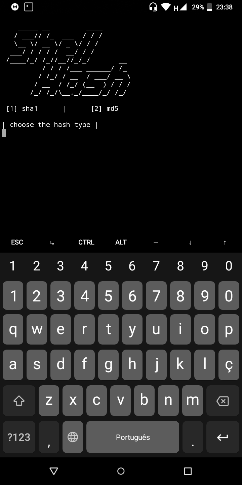
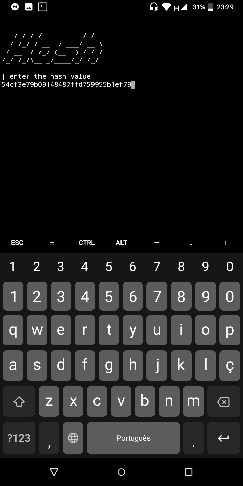
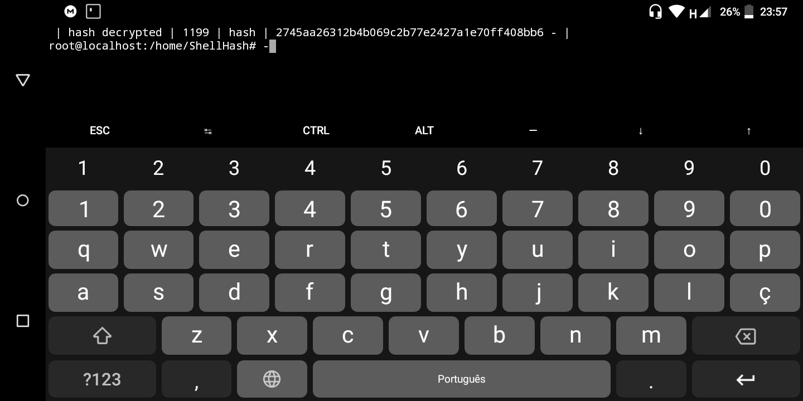

# ShellHash
A simple software made to perform the hash decoding sha1 and md5, using only numbers, the program starts working from the number "0" and keeps increasing the number until the hash is found, the program was designed to run using only the basic features of linux, however the decryption speed was not satisfactory, so I do not recommend using this program for professional purposes, it is just an experiment, the performance will not be satisfactory.

   _____                              _           _       
  / ____|                            | |         | |      
 | (___   ___ _ __ ___  ___ _ __  ___| |__   ___ | |_ ___ 
  \___ \ / __| '__/ _ \/ _ \ '_ \/ __| '_ \ / _ \| __/ __|
  ____) | (__| | |  __/  __/ | | \__ \ | | | (_) | |_\__ \
 |_____/ \___|_|  \___|\___|_| |_|___/_| |_|\___/ \__|___/
                                                          
                                                          

